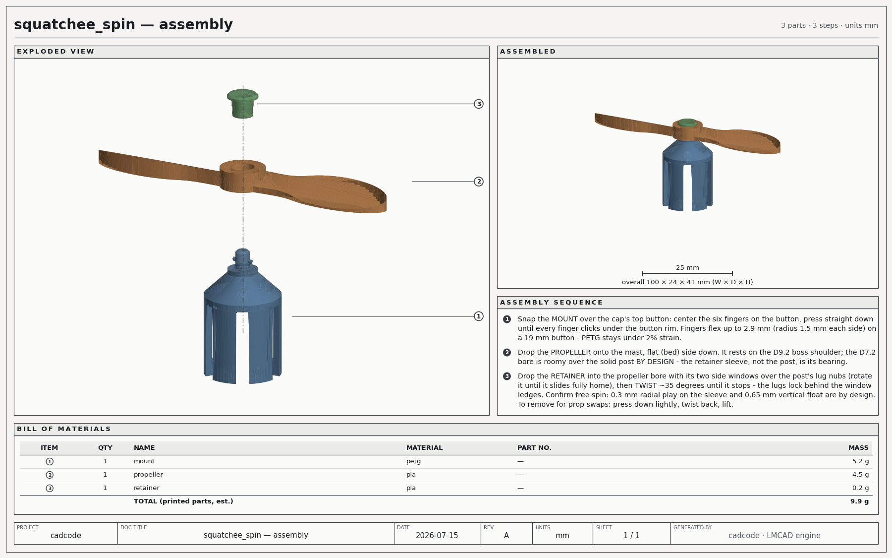

# LMCAD — a hybrid CAD engine built to be driven by AI

[](https://github.com/Himanshu8881212/CadEngine/actions/workflows/engine.yml)
[](https://github.com/Himanshu8881212/CadEngine/actions/workflows/analysis-gate.yml)
[](LICENSE)

> **Status: alpha / experimental.** Builds and validation pins are substantial,
> but only artifacts regenerated by the current strict export path and accepted
> by `.github/workflows/release.yml` are release candidates. Historical committed
> showcase STLs and receipts must not be treated as manufacturing certification.
> See [SECURITY.md](SECURITY.md) and [analysis tiers](docs/ANALYSIS_TIERS.md).

LMCAD is a Rust CAD kernel with two first-class geometry halves — an **exact B-rep**
side (analytic surfaces, half-edge topology, loop-aware booleans, persistent naming,
STEP) and an **implicit/SDF** side (closed-form fields, TPMS lattices, manifold dual
contouring) — bridged by one `Sdf` trait, with a physics and analysis stack (hex8 FEA,
SIMP topology optimization, modal, buckling, production rules) on top.

The whole engine is exposed as a **JSON op surface (161 ops)** and a 10-tool MCP server,
because it was designed from the start to be *operated by a language model* under one
rule:

> **Receipts, not claims.** Every measure carries its `provenance`. Every export names
> its `route` (`exact` vs `voxel_healed`) and whether it came out `watertight`. A model
> driving this engine may not claim anything the report does not say — and when the
> kernel cannot do something exactly, it **refuses** instead of quietly degrading.

That rule is why this repo can show you a finished, printable, physically-checked object,
let you re-derive every number in it from source in under a minute — and then point you
at the same object out in the world, on Printables, being printed by strangers.

---

## The example: SQUATCHEE-SPIN

### ▸ Live on Printables: [SQUATCHEE-SPIN →](https://www.printables.com/model/1777704-squatchee-spin)

> Entered in Printables' **Cap Hacks** contest (July 2026, **204 entries**).
> Standing at the close of entries: **444 likes · 4.6★ · 1.2K downloads** —
> **3rd by likes** across the entire field. Jury result pending.

A clip-on propeller for the button on top of a baseball cap. (That button is called a
*squatchee*.) Three printed parts, **9.9 g**, zero hardware, zero supports — designed,
gated and documented end-to-end by a model driving LMCAD over MCP.

This README is not here to prove the engine *exists*. It is here to prove the engine
**works** — and the difference between those two things is those numbers. Anyone can
publish a render. This is a real listing, judged against 203 models made by people in
real CAD tools, that 1.2 thousand strangers downloaded and printed on machines that do
not care how the geometry was authored.

(The contest brief asked for "a 3D printable add-on, fix, holder, or decoration for a
cap… or add something unnecessary — *like a tiny propeller*." So the brief called its
shot, and the engine answered it with tolerance stacks and a measured retention control.)

<p align="center">
  
</p>

It is a toy on purpose. A toy is the *hardest* honest demo, because nothing about it can
hide behind a rendering: it either snaps onto the cap, spins without wobbling, and stays
on — or it doesn't. Every one of those three properties is a machine receipt below, not a
sentence someone wrote.

**Everything shipped for it lives in [`showcase/squatchee_spin/`](showcase/squatchee_spin/):**

```
showcase/squatchee_spin/
├── print/       historical print STLs — regenerate before slicing
├── programs/    the JSON programs that BUILD those STLs, + every verification job order
├── receipts/    the machine receipts the claims below come from
├── docs/        assembly document, drawing sheets, human instructions
└── printables_listing.md   the listing text, written from the receipts
```

### Re-derive it yourself (~30 s, no MCP, no Python)

```sh
cargo build -p kernel-api --release
./target/release/kernel-api run showcase/squatchee_spin/programs/prop_program.json --out-dir out/
```

That is the real propeller, rebuilt from the real program. The report it prints is the
one quoted here — the geometry is *the program*, not a mesh someone exported once:

```json
{"api_version": "cadcode.v1",
 "ok": true,
 "ops": [
  { "…": "cylinder / difference / extrude / pose / union — the blade + hub build" },

  {"id": "val", "ok": true, "measures": {
    "closed": true, "manifold": true,      // topology receipts, not assertions
    "euler_characteristic": 0, "genus": 1, // genus 1 — the bore goes all the way through
    "shells": 1, "geometric_ok": true, "valid": true}},

  {"id": "mp", "ok": true, "measures": {
    "volume": 3623.5928158031898,
    "center_of_mass": [4.0269e-10, -1.7660e-09, 2.0668987029777104],
    "provenance": "analytic"}},           // integrated over exact surfaces, NOT the mesh

  {"id": "sup", "ok": true, "measures": {
    "steep_area": 0.0,                    // zero un-printable overhang area
    "max_bridge_span": 0.0,
    "support_free": true,
    "provenance": "faceted"}},            // this one IS measured on facets — and says so

  {"id": "out", "ok": true, "measures": {
    "route": "exact",                     // tessellated from the exact B-rep
    "triangles": 3228, "watertight": true},
   "file": "out/capspin/squatchee_spin_prop.stl"}]}
```

Read the `center_of_mass` line again. The propeller's CG sits **1.8 × 10⁻⁹ mm** off its
spin axis — on a 4.5 g part that is **0.0 g·mm of static imbalance**, and it is a
*consequence* of how the part is built (one blade, posed 180°, unioned), reported by the
analytic mass integrator rather than promised by the designer. That is the whole thesis
of the repo in one field.

### The claims, and the receipt behind each one

| the claim | the receipt | where |
|---|---|---|
| Spins without wobble | CG offset from the spin axis ≈ 1.8e-9 mm → **0.0 g·mm** static imbalance, couple terms 0.0 g·mm² | `mass_properties`, `provenance: analytic` |
| Prints with **no supports, anywhere** | `steep_area` = **exactly 0.0** on all three parts; worst flat micro-ceiling `max_bridge_span` **2.82 mm** (a 0.4 mm nozzle bridges that without thinking) | `support_report` |
| The prop never binds on its pivot | Ø7.2 bore on a Ø6.6 sleeve → **0.30–0.90 mm** diametral clearance across ±0.15 mm printer extremes; interference impossible | `programs/tol_pivot.json` |
| It cannot fall off | **negative control**: lifted while locked, the parts *interfere* by **0.0263 mm³** — the lug physically bears on the ledge | `programs/assembly_program.json` → `c_retention_neg` |
| …but you can still take it apart | **release control**: same lift with the windows untwisted clears by **0.1488 mm** and lifts free | same program → `c_release` |
| Nothing snags on the way in | 18-station descent sweep, `interfering: false` at every station | `receipts/approach_sweep.csv` |
| The twist-lock never scrapes | 9-station 0→−34° twist sweep at constant **0.1487 mm** clearance | `receipts/twist_sweep.csv` |
| The prop clears the lugs going on | 14-station drop-on sweep, zero interference: **0.385 mm** margin squeezing past the lug nubs, **0.200 mm** at the seat | `receipts/prop_drop_sweep.csv` |
| A regenerated part is eligible for slicing | strict closed/orientable manifold, no degenerate or crossing triangles, followed by serialized-file round-trip validation | current `export_stl` receipt: `manufacturing_ready: true`, `round_trip_validated: true` |

The two controls are the part worth stealing. "It won't fall off" is not provable by
measuring a clearance — a clearance only shows two things *aren't touching*. So the
assembly program poses the retainer in the failure attitude and demands the engine report
an **interference**, then poses it in the service attitude and demands a **clearance**. A
retention claim that isn't backed by a measured interference is just a designer's opinion,
and the pipeline treats it as one.

### The part that actually proves it works: v1 broke

Gates prove a model is self-consistent. They cannot prove it survives contact with a
stranger's printer. This one didn't — the first version went up, got printed by other
people, and came back with three complaints. All three were real, and all three were the
*same* root cause: v1 retained the propeller with a **split snap-post** — two ~1 mm
springy prongs standing proud of the hub, which levered off easily and printed as wobbly
per-layer islands with overhanging barbs.

v2 fixed it at the root rather than thickening the symptom:

| what came back from the field | what changed | the receipt |
|---|---|---|
| "the mast snaps off" / "it prints badly" | the snap-post is **gone** — a solid Ø4.4 post on a Ø9.2 boss (one chunky continuous column, hidden inside the hub), with retention moved to a **push-and-twist bayonet**. Nothing in the joint flexes, so printer tolerance can no longer weaken it: the lock is geometry, not spring pressure. | the retention/release control pair above — the reason that negative control exists at all |
| "make the prop hole bigger so the pin goes inside" | bore Ø5.0 → **Ø7.2**, and the retainer grew a Ø6.6 journal sleeve that drops inside it. The prop now spins on a *continuous cylinder* instead of a spindle with a snap slot running under the bearing surface. | pivot fit 0.30–0.90 mm across ±0.15 mm extremes |
| "the walls are too thin" | every non-spring wall to **≥2 mm** (fingers 1.2 → 2.0 mm, dome ~3 mm, a solid ring collar hooping the old crack line at the slot roots) | worst-case snap-over strain went **down**, 1.97% → **≤1.72%** |

That last cell is the one to read twice. Fattening a spring normally makes it *worse* —
a thicker beam strains harder for the same deflection, and these fingers must flex 2.9 mm
per side to swallow a Ø19 button. Getting thicker walls *and* lower strain took
lengthening the flex from 13.3 → 18.4 mm, and the only reason that trade was visible
before printing is that the strain was a computed number in the loop rather than a
judgement call after the fact.

Two honest costs, stated in the listing and not buried: the mount went 3.1 g → 5.2 g of
PETG, and the stiffer springs made the snap onto the cap button noticeably firmer
(~1.6–1.75× the v1 force). v2 is a **matched set** — a v2 prop will not be retained by a
v1 mount.

That loop — ship, get told it broke, fix the cause, re-prove every gate — is the actual
claim this repo is making. The engine is not interesting because it emits valid B-reps.
It is interesting because a failure report from a stranger can be turned back into
geometry, and the receipts tell you whether the fix worked before you spend the filament.

### Rebuild the rest

```sh
# the other two parts, same command shape
./target/release/kernel-api run showcase/squatchee_spin/programs/mount_program.json     --out-dir out/
./target/release/kernel-api run showcase/squatchee_spin/programs/retainer_program.json  --out-dir out/

# the worn-pose assembly: places all three parts and runs the 5 clearance/control checks
./target/release/kernel-api run showcase/squatchee_spin/programs/assembly_program.json  --out-dir out/
```

The boolean pipeline is run-deterministic, so "reproducible" here is not a figure of
speech — the rebuilt STLs are **byte-identical** to the ones committed in `print/`:

```sh
cmp showcase/squatchee_spin/print/squatchee_spin_prop.stl out/capspin/squatchee_spin_prop.stl && echo identical
```

One honest wrinkle, since the numbers are right there: `mass_properties` reports the prop
at **3623.59 mm³** (analytic, integrated over the exact surfaces) while the dossier bills
it at **3622.63 mm³** (the tessellated STL you actually print). They disagree by 0.03%,
and on the hollow mount they disagree by 3.3% — because chorded inner walls shrink a
cavity. Neither number is wrong; they measure different objects, which is exactly why
every measure in this engine ships with a `provenance` tag instead of a bare float.

The verification job orders (`balance_job.json`, the `tol_*.json` fit stacks, the
`sweep_*.json` motion sweeps, `dossier_job.json`) re-run through the MCP tools and the
Python analysis layer in [`tools/`](tools/) — see [`showcase/README.md`](showcase/README.md).

---

## 5-minute quickstart

Prerequisites: Rust (stable). Optional, and only for the physics/vision tools: a Python
with the [ACE](docs/ACE_INTEGRATION.md) package for `ace_*` (env `ACE_PYTHON`), plus
numpy + matplotlib for `render_views`.

```sh
cargo build -p studio-mcp --release     # builds target/release/lmcad-mcp
```

**Path A — Claude Code (no API-key wiring; the engine as native tools).**
[`.mcp.json`](.mcp.json) is project-scoped: open this repo in Claude Code, approve the
`lmcad` server, and design by talking. The model gets the 10 tools listed below;
[`DESIGN_GUIDE.md`](DESIGN_GUIDE.md) is its operator manual.

**Path B — any process, JSON-RPC over stdio.** The server speaks line-delimited
JSON-RPC 2.0. Paste this — it builds a plate, validates it, measures it, exports it:

```sh
printf '%s\n' \
 '{"jsonrpc":"2.0","id":1,"method":"initialize","params":{"protocolVersion":"2025-06-18","capabilities":{}}}' \
 '{"jsonrpc":"2.0","method":"notifications/initialized"}' \
 '{"jsonrpc":"2.0","id":2,"method":"tools/call","params":{"name":"run_program","arguments":{"program":{"ops":[{"id":"plate","op":"box","min":[0,0,0],"max":[60,40,8]},{"id":"check","op":"validate","in":"plate"},{"id":"vol","op":"exact_volume","in":"plate"},{"id":"out","op":"export_stl","in":"plate","file":"quickstart/plate.stl"}]}}}}' \
 | ./target/release/lmcad-mcp
```

The tool result is the kernel's report — `exact_volume: 19200.0` for a 60×40×8 plate,
exactly, with `provenance: "analytic"`; `route: "exact"`, `watertight: true` on the
export. Exports land under `studio_out/mcp/` (override with `CADCODE_OUT_DIR`). A failing
op returns a machine-matchable error naming its scope and the alternatives — nothing
degrades silently.

**Path C — headless CLI, no MCP** (the path the example above uses):

```sh
cargo run -p kernel-api --release -- run program.json --out-dir out/   # exit 0 iff ok
# or through the studio server + terminal client:
cargo build -p studio-server -p studio-tui --release
./target/release/lmcad-tui --run program.json    # auto-spawns the server, prints the report
```

The op-by-op JSON reference is [`API.md`](API.md); the `describe_api` op serves the same
sections at runtime, so a model can look up an op instead of guessing at one (unknown
params are ignored — which is precisely why the tool descriptions tell it to check first).

## Architecture

| crate | role |
|---|---|
| [`crates/kernel-core`](crates/kernel-core) | math, `Mesh` + STL/OBJ/PLY/3MF/glTF I/O, exact predicates, BVH, mesh validation/repair, Surface Nets, DFM + support-necessity reports |
| [`crates/kernel-implicit`](crates/kernel-implicit) | SDF primitives (incl. Gyroid TPMS), strut lattices, textures/text, CSG/blends, manifold dual contouring, narrow-band + sparse/octree grids, mesh→SDF bridge (winding-number sign) |
| [`crates/kernel-brep`](crates/kernel-brep) | analytic surfaces, half-edge topology + persistent naming, extrude/revolve/loft/sweep, loop-aware booleans, fillets/chamfers, NURBS, adaptive tessellation, analytic mass properties, STEP import/export (real analytic quadrics, not mesh dumps) |
| [`crates/kernel-model`](crates/kernel-model) | parametric `Document`/feature tree, 2D sketch + LM constraint solver, assemblies (mates, clearance/interference), parts catalog, materials, drawings, cost, hybrid routing, campaign gates |
| [`crates/kernel-api`](crates/kernel-api) | the JSON op surface: 161 ops, one `Report` type — the contract everything above speaks (the 52 hardware-catalog ops no campaign uses sit behind the default-on `catalog` feature — `docs/OP_USAGE.md`) |
| [`crates/agent-bench`](crates/agent-bench) | the 36-criterion agent-surface ruler + the ≥5-part end-to-end benchmark |
| [`legacy/`](legacy/) | parked, **not built**: `kernel-gpu` (wgpu preview/bulk field extraction; CPU stays bit-authoritative), `kernel-wasm` (wasm bindings) and the pre-JSON Rust example campaigns — `legacy/README.md` has the restore steps |

Around the kernel:

- [`studio/`](studio/) — `studio-server` (axum, kernel in-process: work orders, `.lmcpart`
  sessions, SSE chat harness), `studio/web` (three.js IDE), `studio/tui`
  (**`lmcad-tui`**), `studio/mcp` (**`lmcad-mcp`**, the MCP stdio server).
- [`tools/`](tools/) — the Python analysis layer the model drives: ACE FEA/modal/buckling
  runners *with their closed-form validation pins*, SIMP optimization, graded infill,
  air-topology audit, tolerance stacks, balance/joint/sweep checks, production dossier,
  render sheets, assembly docs — laid out as [`tools/analyzers/`](tools/analyzers/)
  (every registered analysis surface), [`tools/publish/`](tools/publish/) (renderers and
  document emitters), [`tools/validation/`](tools/validation/) (the ground-truth pins),
  [`tools/tests/`](tools/tests/) (the gate suites), with the shared contracts at the top
  level and a forwarding shim at every old flat path (`tools/<name>.py` still runs; map in
  [`tools/_layout.py`](tools/_layout.py)). [`tools/solvers/`](tools/solvers/) is the solver
  registry: one card per solver stating its physics, contract, measured benchmarks and
  **validity limits** — a case outside those limits is a new solver or a declared gap,
  never a shrug.
- **The 10 MCP tools**: `run_program`, `describe_api`, `run_assembly`, `ace_fea`,
  `ace_optimize`, `ace_modal`, `ace_buckling`, `graded_infill`, `production_check`,
  `render_views` (a 12-view contact sheet returned as an image — vision in the loop; it
  exists because a speaker enclosure once passed every numeric gate with its air channels
  sealed shut, and only eyes caught it).

## Honest limits

The engine's own list of what it can't do, kept current because CI checks that the docs
still match the source:

- **Voxel FEA under-reads peak stress.** Coarse hex8 under-predicts peak bending stress
  by ~20% vs a converged mesh (pins: −11.2% coarse / −5.9% refined vs the closed-form
  cantilever — converging from the conservative side, `tools/validation/ace_fea_validation.py`). The
  tools echo this in their own receipts. Modal reads slightly stiff (+4.0%/+0.9%);
  buckling factors are upper bounds (+7.3%/+3.0% on the Euler pin).
- **Optimized parts come back as meshes.** `ace_optimize` and `graded_infill` return a
  density grid + a watertight-or-fail STL. There is no density→B-rep reconstruction.
- **The implicit↔exact bridge is one-directional, by contract.** Exact solids and meshes
  can enter the implicit world (`hybrid_boolean` even keeps untouched exact faces
  verbatim), but a field only ever leaves as a voxel-accurate *mesh*
  (`voxel_implicit` / `voxel_healed`) — never as an exact B-rep.
- **Coincident-face booleans are a real frontier.** A planar face exactly tangent to a
  curved wall (and some parallel-flank sliver overlaps) is *refused* by the `try_*` path
  rather than mis-stitched; the refusal now names the remedy. Pinned repros in
  [`docs/BAR.md`](docs/BAR.md) and [`docs/ROBUSTNESS.md`](docs/ROBUSTNESS.md).
- **Fillets: convex rims only** (`fillet_circular_rim`, exact-torus rims); NURBS faces
  don't survive booleans (they tessellate at the cut); STEP still lacks trimmed-NURBS
  faces and sphere poles.
- **Fatigue data is thin and says so.** Only PLA has measured printed S-N; PETG/ABS are
  refused as insufficient, and *across-layer* fatigue is unknown for every material — the
  runner refuses rather than reuse a static ratio.
- **The doctrine is enforced by receipts, not trust.** With Claude-class models the
  contract holds in live fire; weaker models drop it more often. Treat a transcript's
  *receipts* as the source of truth, never the model's prose. (This is why every number
  in this README traces to a file you can run.)

## Evidence

- **Validity:** random feature chains stay valid B-reps **100.00%** of the time
  (10 000/10 000, both runs byte-identical, ratcheted floors in CI) —
  [`docs/ROBUSTNESS.md`](docs/ROBUSTNESS.md).
- **Determinism:** the boolean pipeline is run-deterministic — 40× bit-identical rebuilds,
  `tests/determinism.rs`.
- **Grade:** v1.0 sits at **9.5/10** on the falsifiable ladder in
  [`docs/BAR.md`](docs/BAR.md) — a ladder written to be *failed*, not passed.
- **The docs are falsifiable too:** `tools/audit_docs.py` mechanically checks every op
  count, path, cross-reference, symbol and proof-claim in the doc corpus against source,
  and CI gates on it — a doc that drifts from the code fails the build.

```sh
cargo test --workspace --release        # the full suite — keep it green
cargo clippy --workspace --all-targets  # keep it at zero
cargo run --example parts_gallery -p kernel-model --release   # end-to-end acceptance, exit ≠ 0 on FAIL
python3 tools/audit_docs.py             # doc-drift audit, exit ≠ 0 on error
```

More: [`docs/NUMERICS.md`](docs/NUMERICS.md) tolerance contracts ·
[`docs/BENCH.md`](docs/BENCH.md) wall-clock baselines ·
[`docs/FRICTION.md`](docs/FRICTION.md) the dogfood friction log (failures written up in
full) · [`docs/ANALYSIS_DOMAINS.md`](docs/ANALYSIS_DOMAINS.md) what an agent may honestly
analyze · [`docs/FIELD_REPORTS.md`](docs/FIELD_REPORTS.md) the physical-failure ledger ·
[`DESIGN_GUIDE.md`](DESIGN_GUIDE.md) the operator manual (every snippet in it executed).

## License

MIT — see [`LICENSE`](LICENSE).
